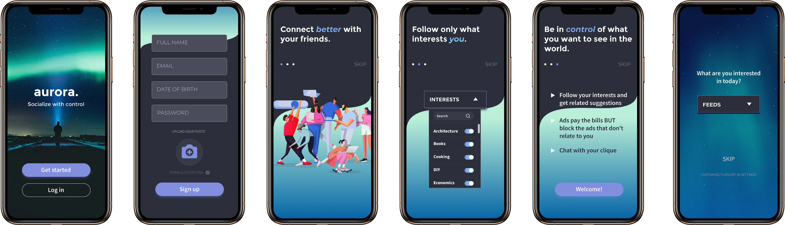

Aurora is a social media app providing users with better control over their viewed content and social experience.

---
My Role:Product Designer, User Researcher, Data Analyst

My Partner:[Taylor Thompson](https://www.taylorelainethompson.com/) (Product Designer, User Researcher, Data Analyst)

Duration: 3 weeks

Tools: Pen & Paper, Figma, InVision, Google Forms, Miro, Zoom, Flowmapp, Trello

Platform: iOS

Summary: This project was completed as part of an open-ended design challenge with the Georgia Tech UX/UI Design Bootcamp. This was our final project before graduating, so we wanted to push ourselves creatively and tackle a difficult problem space. Inspired by the recent push for more ethical design in social media platforms, we chose to design our own version of a social app. We initially assumed that we would be designing for a less addictive social platform, but our research indicated that users are looking for more control over the content they see on their feeds. We found that most people can easily identify some negative effects from their social media use, and most have self-created boundaries to mitigate these negative effects. In an effort to support users in creating their ideal social media experience, we designed the Aurora app. Aurora is a social app that allows for user-curated feeds and more user-control over what they see and when they see it. Our primary target users are people already active on social media but who want more control over the content they consume. Our secondary target users are people who do not currently use social media but who might if they had more control and boundaries when using the platform. The main constraints of the project were a lack of research budget and a 3-week timeline.
